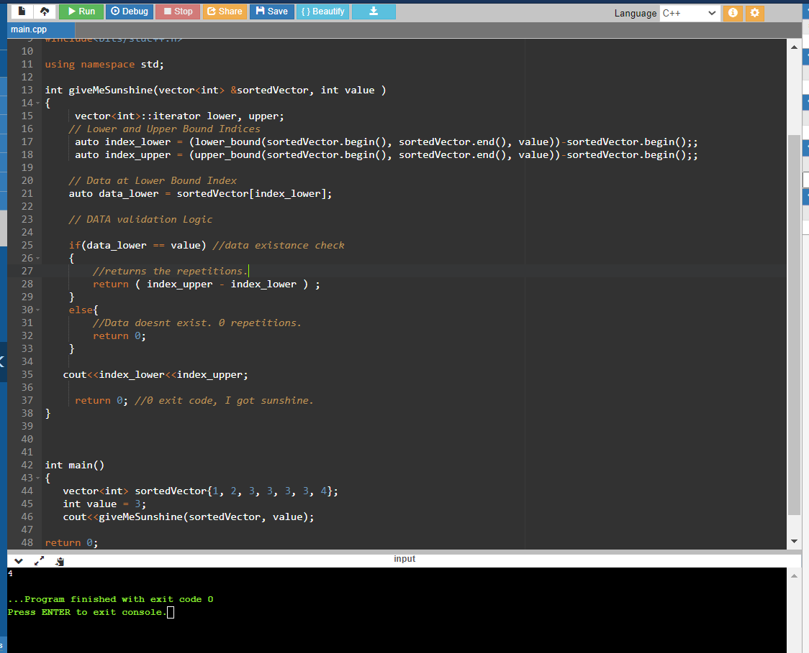

# 📒 My Approach.
1. Getting Lower Bound and Upper Bound Indices of the sorted vector or array ( I am in CPP so prefer vectors) 
2. Get the data at lower bound Index
3. Validation of Existence of Data
4. If Validation success, return the difference between, lower and upper bound data.
5. If Validation failed, return 0 , as there is no data existance.

# Output: 

